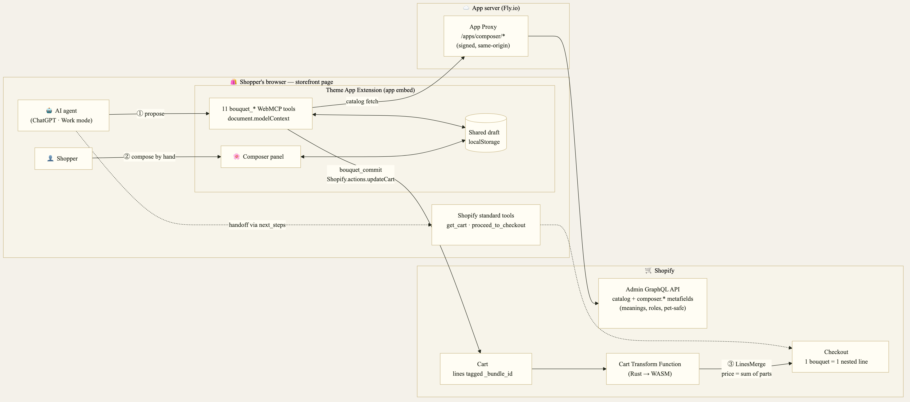
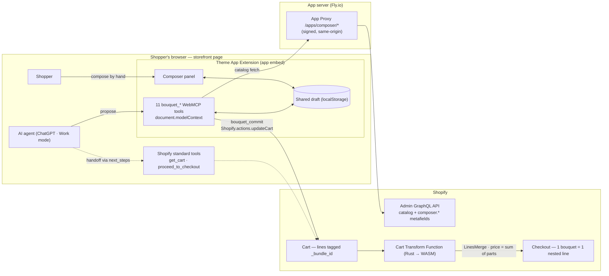

# Bundlepose

**Agents propose. People compose. Shopify bundles.**

A Shopify app where a shopper and an AI agent compose a product that doesn't exist yet — a
custom bouquet — on the same storefront page, and a Cart Transform Function turns it into
**one real, purchasable cart line priced as the exact sum of its parts**.

Built for [The WebMCP Challenge](https://webmcp.devpost.com/) (2026).

|                               |                                                                       |
| ----------------------------- | --------------------------------------------------------------------- |
| 🌸 Live demo store            | https://webmcp-challenge-by-meefa.myshopify.com (password: `mfmcp26`) |
| 📖 Judge's guide (start here) | https://webmcp-challenge-by-meefa.myshopify.com/apps/composer/guide   |
| 🏠 Landing page               | https://webmcp-bouquet.fly.dev                                        |
| 🎬 Demo video                 | https://youtu.be/zhql_cqvycw                                          |

## How it works

1. **The agent proposes.** Through 11 `bouquet_*` WebMCP tools registered on every storefront
   page, the agent reads the florist's rules and today's flowers (real Shopify variants with
   metafields for role, color, flower meaning, occasions and pet safety) and drafts a bouquet
   within the shopper's budget.
2. **The person composes.** The draft appears in a composer panel (🌸) on the same page. The
   shopper adjusts quantities, removes a stem, picks the wrap — by hand. The agent sees those
   edits on its next `bouquet_get_state` call and rebalances. One shared draft, edited from
   both sides.
3. **Shopify bundles.** `bouquet_commit` — the only tool allowed to touch the cart — validates
   the draft and adds it. A Cart Transform Function (Rust → WASM) merges stems, wrap and
   arrangement fee into one bouquet line. Checkout shows the parent line with its recipe
   nested underneath; several bouquets stay several clean lines.

Shopify's own storefront WebMCP tools (`search_catalog`, `get_cart`, `proceed_to_checkout`…)
already handle discovery and checkout, so Bundlepose does not reimplement them: `bouquet_commit`
returns `next_steps: ["get_cart", "proceed_to_checkout"]` and hands off.

## Architecture





**WebMCP implementation.** `extensions/composer-embed/assets/composer.js` registers the tools
with `document.modelContext.registerTool()` (imperative API) from a Theme App Extension
_app embed_, i.e. in the storefront's top-level document — ChatGPT does not detect tools
registered inside iframes, which rules out the embedded admin and checkout extensions. Tool
`execute` handlers run in the normal page context, so they call the store's own domain through
a signed Shopify App Proxy (`/apps/composer/*`) with no CORS and no second auth system.

**Bundling.** `extensions/bouquet-cart-transform` (Rust) groups cart lines by the hidden
`_bundle_id` attribute and emits a `LinesMerge` under a "Custom Bouquet" parent variant
(`requiresComponents: true`, price 0 — the merged line is priced as the sum of its
components). Missing config = no-op, so checkout never breaks.

### The tools

| Tool                                         | Purpose                                                                                | Writes cart? |
| -------------------------------------------- | -------------------------------------------------------------------------------------- | ------------ |
| `bouquet_get_rules`                          | Slots (focal / filler / greenery), stem limits, wraps, fees, default budget, lead time | no           |
| `bouquet_list_components`                    | Today's flowers, filterable by role, color, occasion, pet safety, price, name          | no           |
| `bouquet_create`                             | Start a draft (name, budget, occasion, recipient) → `bundle_id`                        | no           |
| `bouquet_get_state`                          | All drafts **including the shopper's hand edits** and `changes_since_cart`             | no           |
| `bouquet_add_items` / `bouquet_remove_items` | Edit stems in a draft (inventory-capped)                                               | no           |
| `bouquet_set_wrap` / `bouquet_set_note`      | Wrap choice; card message / recipient name                                             | no           |
| `bouquet_validate`                           | Rules, inventory, budget → `ok`, violations with `{code, message, hint}`               | no           |
| `bouquet_commit`                             | Validate, then add or update the bouquet as one bundled line                           | **yes**      |
| `bouquet_discard`                            | Delete a draft                                                                         | no           |

## Try it

The store is password-protected: **`mfmcp26`**.

### Path A — ChatGPT in-app browser (recommended)

1. Latest ChatGPT **desktop app** (Enterprise/Edu workspaces don't support site tools).
2. Settings → Browser → Permissions → **Enable site tools**.
3. Open the [judge's guide](https://webmcp-challenge-by-meefa.myshopify.com/apps/composer/guide)
   in the built-in browser and enter the password.
4. Switch to **Work mode** and pick **GPT-5.6 Sol** (or Terra). "Site tools" appears in the
   address bar. Default/Auto and Luna do **not** expose site tools.
5. Ask: _"Make a warm-toned bouquet for my mother's 60th birthday, under $40."_
6. Open the 🌸 button (bottom right) and change one stem's quantity by hand.
7. Ask: _"I changed the bouquet by hand — read the latest state and rebalance it within my
   budget."_ Then ask for a card message based on the flowers' meanings, and to add it to the cart.
8. The browser opens the cart: one merged bouquet line. Continue to checkout to see the recipe
   nested underneath.

### Path B — Google Chrome (per the official rules)

1. Chrome 149+, enable `chrome://flags/#enable-webmcp-testing`, restart.
2. Open the store, enter the password.
3. DevTools → Application → **WebMCP** lists the 11 `bouquet_*` tools next to Shopify's
   standard tools and can execute them (run `bouquet_create` first, then finish by hand in the
   composer). The Model Context Tool Inspector extension (Chrome 150+, Gemini API key) works too.

> **Gemini in Chrome does not consume WebMCP tools as of August 2026 (Chrome 151).** Please
> don't judge via that path.

## Repository layout

```
app/                      React Router 7 app (embedded admin + App Proxy endpoints)
  routes/api.proxy.*      /apps/composer/{catalog,guide,ping} — signed App Proxy routes
  routes/app.setup.tsx    one-click seed of the demo florist + Cart Transform activation
  lib/bouquet-catalog.server.ts   demo catalog (14 stems, 2 wraps, fee, merge parent)
extensions/
  composer-embed/         Theme App Extension: WebMCP tools + composer panel + banner block
  bouquet-cart-transform/ Shopify Function (Rust): group by _bundle_id → LinesMerge
docs/learn/               engineering notes written during the build (Japanese)
docs/assets/              architecture diagram (PNG + Mermaid source)
fly.toml, Dockerfile      production hosting (Fly.io, SQLite on a volume)
```

## Running it yourself

### What you need

This is a Shopify app, so it cannot run standalone — it needs a store to live in:

1. A **[Shopify Partner account](https://partners.shopify.com/)** (free).
2. A **development store** created from the Partner Dashboard (free). Any Liquid theme works;
   the demo uses Shopify's _Horizon_ theme.
3. A **Shopify app** record, created for you by `shopify app config link` below (this fills
   `FILL_YOUR_CLIENT_ID` and the URLs in `shopify.app.toml`).
4. Locally: Node.js ≥ 20.19, [Shopify CLI](https://shopify.dev/docs/apps/tools/cli), and Rust
   with the `wasm32-unknown-unknown` target (`rustup target add wasm32-unknown-unknown`) to
   build the Cart Transform Function.
5. To test with an agent: ChatGPT desktop (Work mode) or Chrome 149+ with the WebMCP flag —
   see [Try it](#try-it). The storefront must be reachable by that browser, so for ChatGPT you
   need either the dev tunnel that `shopify app dev` opens or a deployed app.

### Local development

```bash
npm install
cp .env.example .env
shopify app config link    # creates your app in the Partner Dashboard and writes shopify.app.toml
shopify app dev            # tunnels to your dev store (set automatically_update_urls_on_dev = true)
```

Then, in the embedded admin app, open **Bouquet setup** and click **Seed products** — this
creates the demo florist catalog (14 stems with `composer.*` metafields, 2 wraps, an
arrangement fee, the "Custom Bouquet" merge parent, and 4 regular products) in your dev store.

Product photos are not included in this repository (they were AI-generated for the demo
store and live on Shopify's CDN). The **Upload images** action reads a local folder that only
exists on our dev machine — skip it and add your own images in the Shopify admin if you want
photos.

Cart Transforms only run once the Function is deployed, so:

```bash
shopify app deploy         # deploys the Function + Theme App Extension
```

…then click **Activate cart transform** in Bouquet setup, and enable the **Bouquet Composer**
app embed in the theme editor (Online Store → Themes → Customize → App embeds). Optionally
place the **Composer Banner** block on the home page.

Function tests: `cd extensions/bouquet-cart-transform && npm test` (vitest + fixtures).

### Deploying

The app server is a plain Node.js/React Router server with SQLite for sessions, so it runs on
any host that can run a Docker image or `npm run build && npm start`. The demo uses
**Fly.io** (`fly.toml`, `Dockerfile`), but that is only an example:

```bash
fly launch                 # or your platform's equivalent; mount a volume for /data
fly secrets set SHOPIFY_API_KEY=... SHOPIFY_API_SECRET=... SCOPES=... DATABASE_URL=file:/data/prod.sqlite
fly deploy                 # app server
shopify app deploy         # extensions + Function
```

After deploying, point `application_url`, `redirect_urls` and `app_proxy.url` in
`shopify.app.toml` at your host and run `shopify app deploy` again so Shopify picks up the
URLs. Keep `automatically_update_urls_on_dev = false` so a later `shopify app dev` does not
overwrite them. The App Proxy needs a public HTTPS host: it is what lets the storefront's
WebMCP tools call your server same-origin.

## Known limitations

- Draft creation is agent-initiated by design (`bouquet_create`); there is no "new bouquet"
  button in the panel. Everything after that can be done by hand.
- Per-role minimums (focal / filler / greenery) are reported by `bouquet_get_rules` but not yet
  enforced by `bouquet_validate`; total stem count, inventory and budget are.
- Drafts live in the browser (`localStorage`); server-side persistence and transactional
  re-validation at commit are the next step.
- The theme's cart drawer shows the parent product name ("Custom Bouquet"); the bouquet's own
  name is carried as a visible line attribute and shown at checkout.

## License

MIT — see [LICENSE](LICENSE). Scaffolded from Shopify's
[shopify-app-template-react-router](https://github.com/Shopify/shopify-app-template-react-router)
(MIT, Shopify Inc.).
